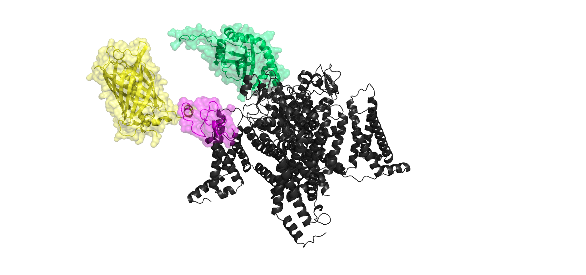

__Jacob Browne__

I work in the department of pharmacology in the Miller lab. My project is based on creating a __BRET__ _(Bioluminescent Resonance Energy Transfer)_ assay for Nav1.9. The image is an example construct where a bioluminescent nLuc tag is attached to a __VSD__ (voltage sensing domain), and a ProTxII toxin attached to a fluorescent mVenus is bound to a different VSD. The construct was built using a mixture of aphafold and pymol manipulation. 

